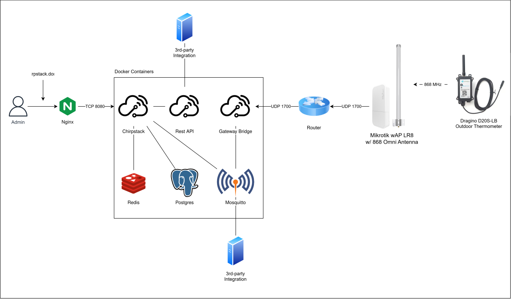

# poc-lora-thermometer
LoRa-based thermometer solution with self-hosted Chirpstack, Mosquitto, Postgres and Redis.  
Suitable for temperature monitoring by the ocean or lakes where internet access is limited.

## Architecture Diagram

## Overview
- **Dragino D20S-LB** outdoor thermometer sending LoRa packets on 868Mhz
- **Mikrotik wAP LR8** gateway receives LoRa packets and forwards via UDP 1700
- **ChirpStack Gateway Bridge** receives UDP traffic and sends to Mosquitto MQTT broker
- **ChirpStack** processes the data and stores in Postgres
- **3rd-party integrations** through MQTT or Rest API

## Deployment
See [docker-compose.yml](deployment/docker-compose.yml) for containerized setup.

### Configuration (Not done)
1. Change environment variable POSTGRES_PASSWORD in compose file.
2. Edit chirpstack.toml in configuration/chirpstack:  
   a. Change password for integration.mqtt  
   b. Change dns under postgresql to your username and password  
   c. Change secret for API if needed in your setup  
3. Edit chirpstack-gateway-bridge.toml and set password generated in mosquitto passwd
